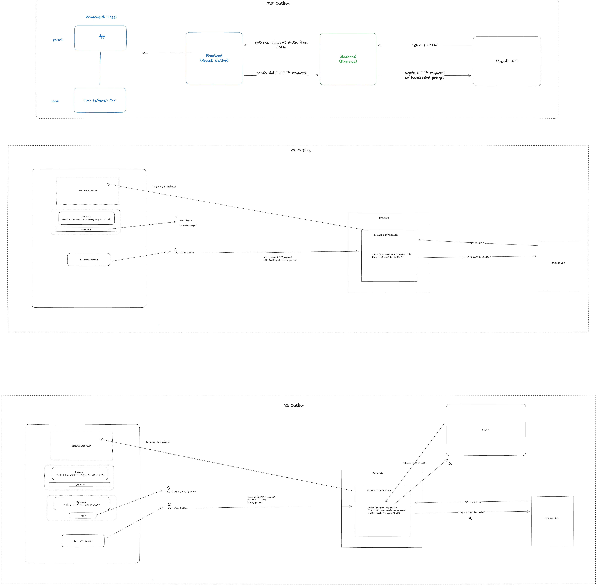
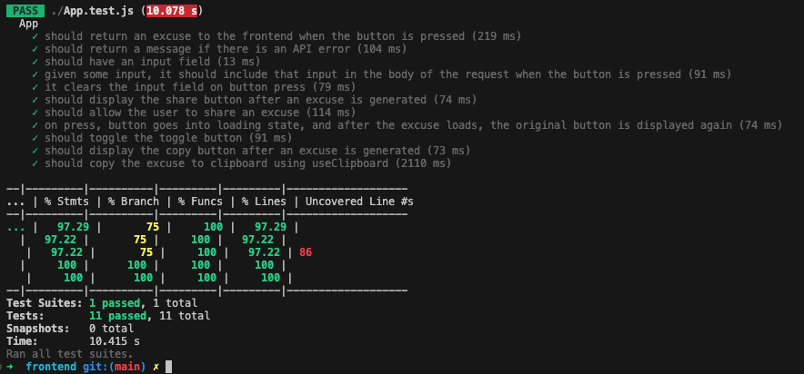
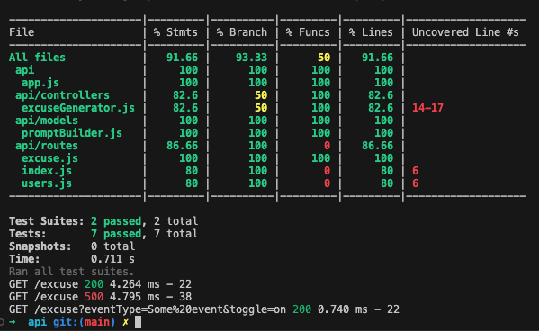

# Excuse App

## Index

- [App Description](#app-description)
- [Project Description](#project-description)
  - [Intro](#intro)
  - [Learning Goals](#learning-goals)
  - [Design Process](#design-process)
  - [Reflections](#reflections)
- [Installation](#installation)
- [Running the App](#running-the-api-locally)
- [Testing](#testing)
  - [Testing Framework](#testing-framework)
  - [Running the Tests](#running-the-tests)
  - [Test Coverage](#test-coverage)
- [Technology](#technology)
- [Credits](#credits)

## App Description

Introducing our innovative app, Excuse! Have you ever found yourself in a situation where you needed a clever excuse to gracefully bow out of an event? Look no further! Excuse is here to save the day. With the power of the OpenAI API, our app generates hilarious and quirky excuses tailored to your specific event. But that's not all! We've taken it a step further by incorporating real-time data from NASA's Eonet API. If you're feeling extra creative, Excuse can even weave in a current natural event to make your excuse truly unforgettable. Whether you need an excuse for a last-minute cancellation or a playful exit strategy, Excuse has got you covered. Say goodbye to awkward moments and hello to ingenious excuses with Excuse!

## Example Excuses

“Sorry, but I can’t make it to the event. I have to attend my cat’s birthday party. They turn 1 today and have been planning this extravaganza for months. There will be a red carpet, a DJ spinning mouse-themed tunes, and a gourmet buffet all catered for by the finest local catnip chef. It’s an event of the paws-itively highest importance!”

"I can't make it to work today because I accidentally joined a secret society of wizards and today is our annual broomstick racing tournament. The magic council informed me that my presence is absolutely necessary as I have been chosen to fly the fastest broomstick in the race. I apologize for any inconvenience this may cause.
"

"I can't make it because I accidentally discovered a hidden treasure map while cleaning my basement and I have to go on a pirate adventure to find the loot. Oh, and did I mention that the map was written in the ancient language of parrots? Yeah, it's going to be a wild ride.
"

"I can't make it because Tropical Storm Calvin set off a chain reaction in the weather patterns which resulted in me being stuck in a time loop. So, unfortunately, I'll be trapped in a groundhog day-esque scenario indefinitely. Apologies for the inconvenience!
"

"I can't make it to Maker's Demo Day because I'm currently busy grappling with a swarm of stampeding mutant chickens that were unleashed by the chaotic aftermath of the Ubinas Volcano in Peru. They've developed a taste for technology and are wreaking havoc on all electronic devices. It's a battle to save humanity from the clutches of these high-tech fowl! Sorry for the inconvenience!
"

"I can't make it because I've taken up a new hobby - Extreme Cactus Hugging - and I accidentally got stuck in the middle of the Wilbur Fire in Arizona. Don't worry, though, I've heard the fire department is sending their best team of cactus whisperers to rescue me. I'll be there as soon as they untangle me from this prickly situation!"
"

## Project Description

### Intro

Excuse is our final Project of [Maker's Academy](https://makers.tech/) Bootcamp. Excuse is an AI-powered excuse generator for iOS and Android phones. This section describes our goals for the project, our design process, and reflections. 

### Learning Goals

- Create a mobile application with React Native
- Learn to use the Open AI API and NASA's EOnet API
- Practice AGILE Development and TDD

### Design Process:

Click on the image below to view our design diagrams more closely:


We decided on an iterative process:
- V1 (our MVP) is simply a button that generates an excuse when pressed using Open AI.
- V2 adds a text field where the user can describe a specific event they need to get out of that will be incorporated in the excuse generator.
- V3 adds a toggle that can be activated to incorporate the latest severe weather event from NASA'S EONET

We organized our workflow using a Trello board and created vertical slice tickets for each new feature, along side styling and research tickets. Working pairs used TDD wherever possible, and we reviewed all pull requests together as a team.

### Reflections

We had a few reflections after finishing this project:

- We aimed to make our MVP as simple as possible with a clear design and end goal. We found this really helpful for iterative development. Having the basic functionality in place relatively quickly made it easier to add features with each version - and it kept team morale high through the whole project.

- We researched End-to-End testing options for mobile applications built with Expo and looked at several frameworks (Detox, Cypress, Cavy). However, after receiving advice from our coaches and from friends in app development, we decided not to automate E2E testing, and instead manually tested E2E using the Expo Go app on our phones. Currently the options available to us are not yet fully robust and we believe the simplicity of our app makes automated E2E testing unnecessary.

- The final takeaway we all had from this project is how exciting it is to work with generative AI. Learning how to 'talk' to GPT Turbo, and to refine our prompt to get the responses we wanted, was both fascinating and invigorating. Over the course of the project, we had many more ideas on features we'd like to add to Excuse that build on the prompt we created. Overall, we're all excited to continue learning and making projects that interact with AI.

## Installation

To install the app, copy and paste these instructions into your terminal:

Note: 

```bash
# Clone the repo
git clone https://github.com/JRSkates/excuse
cd excuse

# Install packages in the frontend and api folders.
cd frontend
npm install 

cd ../api
npm install

```

## Running the app using Expo Go

To try the app on your phone, download the `Expo Go` app from the Play Store or App Store. Then input the following commands in your cloned repo:
```bash
cd frontend
npm start
# This will host a development build of the app locally. 
# To run the build on your phone, scan the on-screen QR code using Expo Go.
```

### Running the API locally

Currently the frontend of the app is pointed toward a hosted version of the API on render. __If the render server is down, or you wish to make local edits to the API,__ you will need to locally run the server and change the app to point towards it. 

In `./frontend/App.js`:

Change line 38: 

```
`https://excuse-s1se.onrender.com/excuse`,
```

to:
```
`http://[your-ip-address-here-without-brackets]:3000/excuse`,
```
Your IP address can be found  easily by running `npm start` and copying the IP address under the QR code listed after `Metro waiting on` between the double slashes and the colon.

__You will also need to use your own OpenAI API key.__ Run the following command in your root directory:
```
echo 'OPENAI_API_KEY="your-key-in-here-as-a-string"' >> ./api/.env
```
If you don't have an Open AI API key, you can [make an account here](https://platform.openai.com/) and request one. They currently come with $5.00 free credit.

### [Optional] Removing SSR warning when hosting  with Expo

If you'd like to remove the SSR Provider warning when hosting the app with Expo, navigate to `./frontend/node_modules/native-base/src/core/NativeBaseProvider.tsx` and remove the following code on line 7 (the whole line):

```
import { SSRProvider } from '@react-native-aria/utils';
```

Then, find line 97 (seen below) and remove the  `<SSRProvider></SSRProvider>` tags so that only `{children}` remains:

```
<SSRProvider>{children}</SSRProvider>
```

## Testing

### Testing Framework

We wrote unit and component tests for our project using:
- Jest with the React Native Testing Library
- Supertest for mocking HTTP requests and responses

### Running the tests

To run the tests from your cloned repo:

```bash
# To run the frontend tests:
cd frontend
jest

# To run the backend tests:
cd backend
jest
```

### Test Coverage

#### Frontend Coverage:



#### Backend Coverage



## Technology

[NodeJS](https://nodejs.org/en)
: A JavaScript (JS) runtime environment and package manager.

[React Native](https://reactnative.dev/)
: An  easy cross-platform framework for mobile app development.

[Native Base](https://nativebase.io/)
: A UI component library for React Native that we used for consistent design across platforms.

[Expo Go](https://expo.dev/client)
: A robust set of mobile application dev tools for React Native.

[Axios](https://axios-http.com/)
: A JS library for making HTTP requests with an easy-to-use API.

[Express](https://expressjs.com/)
: A simple web app framework for NodeJS that we used for our API server.

[Jest](https://jestjs.io/)
: A JS testing framework that we used both frontend and backend unit testing.

[OpenAI API](https://platform.openai.com/)
: An API for generative language model AI.  We generate excuses using the OpenAI API ChatGPT 3.5 Turbo model 

[EoNet Nasa API](https://api.nasa.gov/)
: The Earth Observatory Natural Event Tracker API by NASA.

[Render](https://render.com/)
: A cloud hosting service for applications. We've hosted our backend API on Render.

## Credits

- [George Barrett](https://github.com/georgebarrett)
- [Jack Skates](https://github.com/JRSkates)
- [Mergim Berisha](https://github.com/Mergimberisha)
- [Sharmine Sokataly](https://github.com/sharmine-s)
- [Will de Montmollin](https://github.com/awdem)
- Made during [Maker's Academy](https://makers.tech/) Bootcamp
